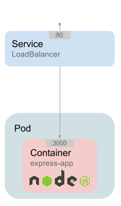
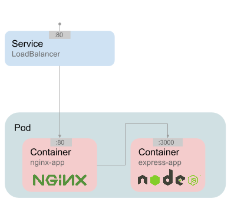

# Deploying our first application on Kubernetes

## Requirements

For this exercise you'll need:

- [gcloud sdk](https://bitnami.com/tools/cloud/google) (since we are using _Google Cloud Platform_)
- [kubectl] (included in _gcloud sdk_)

## Description

In this first example we are going to deploy the [express application from the previous exercise](../0_stacksmith/) on a Kubernetes cluster on GCP.

## Configure your environment

First of all we need to configure our environment to make it point to our infrastructure.

### Initialize _gcloud_

Use this command to configure your local _gcloud_ command line tool:

`gcloud init`

Follow the instructions. The program will ask for:

- configuration name: choose a name like `kubernetes-workshop`

- your credentials (will be provided at the beginning of the workshop): a browser will be launched for you to log in.

- project: the name of the project is on the slides

- compute zone: the compute zone to use is also on the slides

- Source hosting: when asked `Do you want to use Google's source hosting (see "https://cloud.google.com/source-repositories/docs/") (Y/n)?`, say `n`.

- Check you configuration: you can check your config with `gcloud config list`. The result should be similat to:

```
$ gcloud config list
Your active configuration is: [kubernetes-workshop]

[compute]
region = europe-west1
zone = europe-west1-c
[core]
account = someone@bitnami.com
disable_usage_reporting = True
project = kubernetes-ws-0
```

### Initialize _kubectl_

`kubectl` is the CLI client for kubernetes. We have to configure it to point to our Kubernetes cluster.

Since we are using GCP, we can do that with `gcloud`. At the the beginning of the session a cluster will be assigned to everyone. You should have a identifier for your cluter. To make `kubectl` point to that cluster, just run:

`gcloud container clusters get-credentials <ID of your cluster>`

To check it everything have gone fine, run: `kubectl cluster-info`

It should return some information about the cluster.

## What do we have here?

This schema illustrates what we want to deploy:



### Pod

`pod.yml` describes the (pod)[http://kubernetes.io/v1.1/docs/user-guide/pods.html] we are about to create.

Inside the pod we have just a container, which will be created from the image we have built on the [previous exercise](../0_stacksmith/). The image has been uploaded to the project registry (_gcr.io/kubernetes-ws-0/hello-world-node_), so anyone can download it.

### Service

`service.yml` describes a [LoadBalancer Service](http://kubernetes.io/v1.1/docs/user-guide/services.html#type-loadbalancer). We'll need it to access our app from the exterior and this service will allocate a public IP and configure all the network stuff for us.

## Let's run it!


### Create the service

- Create the object in Kubernetes:

`kubectl create -f ./service.yml`

- We can see how the service is going on:

`kubectl get service`

That command will answer with all the services we have in the cluster. Our cluster should appear with the name: `first-deploy`. Notice the field `EXTERNAL_IP`, there should appear our external IP address after a while.

NOTE: This usually takes like a minute, you can continue with the next step and come back to check the service after.

### Create the pod

- Create the object in Kubernetes:

`kubectl create -f ./pod.yml`

- We can see how the service is going on:

`kubectl get pod`

That command should give us all the pods in our cluster. Re-run the command to check if the pod is already `Running`. Try to guess the meaning of the different fields.


### What is happening under the hood?

In the end, this is creating a docker container in one of the nodes in the cluster. We can see the name of that machine running `kubectl get pod <name of the pod> -o wide`.

We could even use ssh that machine and use docker commands to do operations with the container.

Also we can fetch logs from the pods with: `kubectl logs first-pod`

And filtering per container with `-c`: `kubectl logs -c express first-pod`

If you want to keep listening for new log lines, use `-f`: `kubectl logs -f -c express first-pod`

### Check how does it work

Use `kubectl get service` to get the external IP address where our service is listening.

Open your browser and go to `http://<service external IP>`. You should be able to see the web for our application.

Take a look at the logs.

## Shut down the application

### Delete the service

`kubectl delete service first-service` or `kubectl delete -f service.yml`

### Delete the pod

`kubectl delete pod first-pod` or `kubectl delete -f pod.yml`


## Extra: Add another container to the pod

Until now, _express_ have to serve both static (images and css) and dynamic content. The application will perform better if we serve static files with another server like [nginx](http://nginx.org/).



To do that, add a __nginx__ container to the pod and do whatever changes are necessary to make that work as expected.

We have already an image for that container prepared at _gcr.io/kubernetes-ws-0/hello-world-nginx_.

Try to figure out what to change on this example to implement it and also try to do that by yourself.

__HINT__: You just need to change a few lines in `service.yml` and `pod.yml`.

__NOTE__: that nginx image has the [static files](../0_stacksmith/public) inside and the [proper configuration](../0_stacksmith/extra/vhost.conf) for the project. You don't need it, but [here you have the Dockerfile](https://github.com/bitnami/kubernetes-workshop/blob/you-are-not-here/hands-on/0_stacksmith/Dockerfile.statics).

__QUESTION__: How correct do you think this approach is? What would you change?

### Got stuck? Here you have the solution

- [pod](https://github.com/bitnami/kubernetes-workshop/blob/you-are-not-here/hands-on/1_first_deploy/pod_2.yml)

- [service](https://github.com/bitnami/kubernetes-workshop/blob/you-are-not-here/hands-on/1_first_deploy/service_2.yml)

```
wget https://raw.githubusercontent.com/bitnami/kubernetes-workshop/you-are-not-here/hands-on/1_first_deploy/pod_2.yml
wget https://raw.githubusercontent.com/bitnami/kubernetes-workshop/you-are-not-here/hands-on/1_first_deploy/service_2.yml
```
