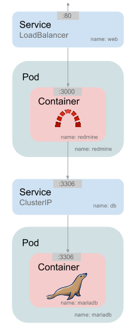

# Multi-tier application on Kubernetes

## Requirements

The same than [before](../1_first_deploy/README.md#requirements).

## Description

In this exercise, we are going deploy a more complex application, [redmine](http://www.redmine.org/) with [mariaDB](https://mariadb.org/) as database.

### Two pods

This time, we have two pods: one for the application and another one for the database.

Also, since we want Kubernetes to control failures, we are creating [replication controllers](http://kubernetes.io/v1.1/docs/user-guide/replication-controller.html) instead of simple pods.

### Two services

We are also using two [services](http://kubernetes.io/v1.1/docs/user-guide/services.html), one for the web part (which is public) and another one for the database (which is private).

## Complete the template

In this folder you have templates for the redmine replication controller (`redmine-rc.yml`)[./redmine-rc.yml], mariadb replication controller (`mariadb-rc.yml`)[./mariadb-rc.yml], redmine web service (`web-service.yml`)[./web-service.yml] and db service (`db-service.yml`)[./db-service.yml].
