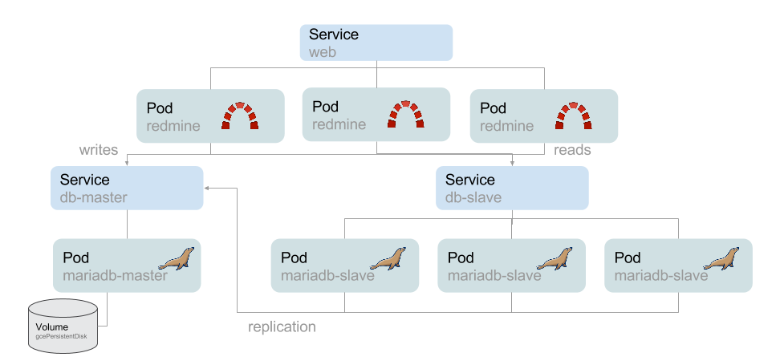

# Scaling redmine

Scaling an application is not easy. Kubernetes can help in many cases.

Take a look at [this great tutorial](https://github.com/bitnami/bitnami-docker/tree/master/gke/redmine) about scaling a redmine application (ruby app + db).

